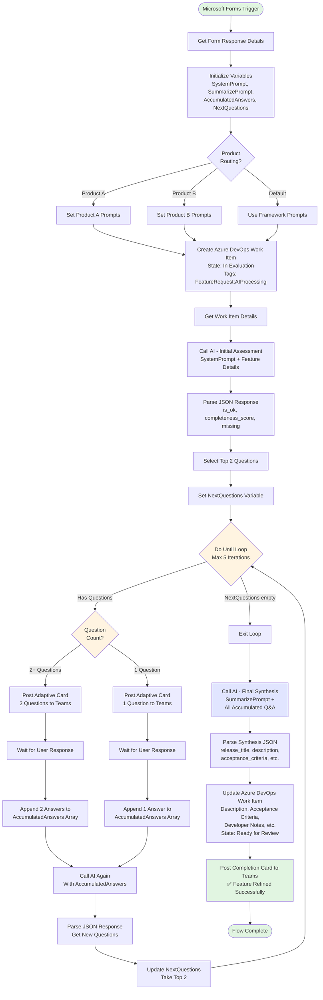

# Quick Start: Customizing the Framework

This guide shows a concrete example of customizing the framework for a fictional product, walking through each step.

## Example Product: TaskFlow Pro

**Product:** TaskFlow Pro - A project management SaaS for creative agencies  
**Tech Stack:** React, Node.js, PostgreSQL, Redis  
**Users:** Project managers, designers, developers at creative agencies  
**Competition:** Asana, Monday.com, ClickUp

Let's customize the framework for this product.

## Step 1: Update Input Format

**Original Framework:**
```markdown
Feature Title: [Title]
Feature Description: [Original description text]
---
Priority/Urgency: [Score or description]
Reusability: [Score or description]
Type: [Feature type/category]
```

**TaskFlow Pro Customization:**
```markdown
Feature Title: [Title from feature request form]
Feature Description: [Description from form]
---
Business Impact: [High/Medium/Low - from form dropdown]
Effort Estimate: [S/M/L/XL - rough sizing from PM]
Feature Type: [Workflow/Reporting/Integration/UI - from form]
Affected Module: [Projects/Resources/Billing/Time Tracking]
----
Requested By: [Email from form]
Agency Name: [Customer agency name if applicable]
Number of Users Affected: [Estimated user count]
```

*Location: Update both framework-ingestion-prompt.md and framework-summarize-prompt.md*

## Step 2: Add Product Knowledge

**In framework-ingestion-prompt.md, replace the generic "Product Knowledge Cross-Check" section:**

```markdown
## TaskFlow Pro Knowledge Cross-Check

Before assessing completeness, check if the requested feature overlaps with existing TaskFlow Pro functionality.

### Common TaskFlow Pro Features:

**Project Management:**
- Project templates with task blueprints
- Gantt chart timeline view
- Project status automation (rules-based status updates)
- Project dependencies and critical path
- Milestone tracking with notifications
- Budget vs actual cost tracking

**Task Management:**
- Task assignment and reassignment
- Task dependencies (blocks/blocked by)
- Recurring tasks with cron-like schedules
- Task templates and checklists
- Custom fields per task type
- Priority levels (Critical/High/Normal/Low)

**Resource Management:**
- Resource allocation and capacity planning
- Workload balancing visualizations
- Skill-based resource matching
- Time-off calendar integration
- Resource utilization reports
- Bench time tracking

**Time Tracking:**
- Timer widget (start/stop tracking)
- Manual time entry
- Time approval workflows
- Billable vs non-billable flagging
- Time locking (prevent edits after date)
- Timesheets with weekly summaries

**Reporting:**
- Standard reports (project status, time by user, budget variance)
- Custom report builder with filters
- Scheduled email reports
- Dashboard widgets
- Export to CSV/Excel
- Report sharing and permissions

**Integrations:**
- Slack notifications
- Google Calendar sync
- Jira two-way sync
- Zapier webhooks
- API access (REST)
- SSO (SAML, OAuth)

**Billing:**
- Time-based invoicing
- Fixed-price milestones
- Expense tracking
- Invoice templates
- Payment tracking
- QuickBooks integration

### Inference Examples for TaskFlow Pro:

**Request:** "Add ability to track time on tasks"
**Match:** Timer widget (start/stop tracking) + Manual time entry
**Question:** "TaskFlow Pro already has a timer widget for real-time tracking and manual time entry forms. Based on your request, I'm inferring you need something different - perhaps (A) mobile app time tracking, (B) offline time tracking, (C) AI-suggested time entries based on activity, or (D) integration with a specific time tracking tool. Which of these matches your need, or is it something else?"

**Request:** "Send notifications when project is behind schedule"
**Match:** Milestone tracking with notifications + Project status automation
**Question:** "TaskFlow Pro has milestone notifications and can auto-update project status based on rules. I'm inferring you want automated 'at-risk' alerts based on criteria like: tasks overdue, budget exceeded, or resource over-allocated. Should the alerts go to project managers, stakeholders, or team members? And what threshold triggers the alert - 1 day late, 10% over budget, etc.?"

**Request:** "Create templates for common project types"
**Match:** Project templates with task blueprints
**Question:** "TaskFlow Pro already supports project templates that include predefined tasks, milestones, and assignments. I'm inferring your request differs because you need (A) industry-specific templates (web design, video production, etc.) pre-built and available, (B) task templates that include checklists and custom fields, or (C) the ability to share templates across agencies. Which scenario matches your need?"
```

## Step 3: Customize Technical Guidance

**In framework-summarize-prompt.md, update the developer_notes examples:**

**Replace generic examples with TaskFlow Pro stack:**

```markdown
**developer_notes.markdown Example:**

**Implementation Approach:**
- Create an event listener on the Task model's update event to detect status changes
- Check if the project has automated status rules configured
- If rules match, call ProjectStatusService to update parent project status
- Emit WebSocket event to update client UI in real-time

**Components Needed:**
- **React Component:** ProjectAutomationRulesConfig.tsx (settings screen)
- **API Endpoint:** PUT /api/v2/projects/:id/automation-rules
- **Background Job:** TaskStatusChangeProcessor (Celery task)
- **Service Layer:** ProjectStatusService.updateFromRules()
- **Database Migration:** Add automation_rules JSONB column to projects table
- **WebSocket Handler:** broadcastProjectStatusChange

**Key Considerations:**
- Use Redis to cache automation rules for performance (reload on change)
- Implement debouncing - if 10 tasks update in 30 seconds, run rules once at end
- Use database transactions to ensure atomic project status updates
- Handle circular dependencies (Project A blocks Project B, B blocks A)
- Emit analytics event for rule execution (track usage, performance)
- Add feature flag for gradual rollout (start with 10% of projects)

**Testing Guidance:**
- **Unit Tests:** ProjectStatusService.test.ts (rule matching logic)
- **Integration Tests:** Test complete flow from task update to project status change
- **E2E Tests:** Cypress test for rules config UI + status update verification
- **Load Test:** 100 concurrent task updates, verify rules process correctly
- **Edge Cases:** Test with disabled projects, archived tasks, deleted assignees

**TaskFlow Pro Best Practices:**
- Subscribe to model events (not direct DB triggers) for extensibility
- Use structured logging with correlation IDs for tracing
- Add feature telemetry to analytics pipeline
- Include error boundaries in React components
- Follow API versioning convention (/api/v2/)
```

## Step 4: Calibrate Estimations

**In framework-summarize-prompt.md, update estimation guidelines:**

```markdown
### Estimating Development Hours (TaskFlow Pro)

Provide realistic estimate for a developer familiar with our React/Node.js stack:

**Estimation Guidelines:**

- **Trivial** (copy change, CSS tweak, config toggle): 0.5-1 hour
- **Simple** (1 React component, simple API endpoint, no DB changes): 4-8 hours
  - Example: Add "Copy Task URL" button to task detail page
  
- **Medium** (Multiple components, API changes, DB migration, business logic): 16-24 hours
  - Example: Add task dependency visualization (blocks/blocked by graph)
  
- **Complex** (New feature area, multiple services, background jobs, integrations): 40-80 hours
  - Example: Implement project budget tracking with variance alerts
  
- **Very Complex** (Major subsystem, external API, real-time sync, data migrations): 120-200 hours
  - Example: Build Jira two-way sync with conflict resolution
  
- **Epic** (Multiple features, platform changes, significant architecture): 200-400 hours
  - Example: Mobile app for time tracking with offline support

**TaskFlow Pro Complexity Factors:**

Add hours for:
- **Real-time updates:** +4-8 hours (WebSocket handling, client state sync)
- **Background jobs:** +4-8 hours (Celery tasks, retry logic, monitoring)
- **Database migration on large table (tasks, time_entries):** +8-16 hours (careful planning, zero-downtime)
- **API versioning:** +2-4 hours (maintain v1 compatibility while adding v2)
- **Feature flag implementation:** +2 hours (LaunchDarkly integration, gradual rollout)
- **New integration (Slack, Jira, etc.):** +16-40 hours (OAuth, webhooks, error handling)
- **Export/import large datasets:** +8-16 hours (streaming, pagination, validation)
- **Complex permissions:** +8-16 hours (row-level security, role combinations)

**Round to:** 0.5 hours for <8h, 1 hour for 8-40h, 4 hours for 40h+
```

## Step 5: Adjust NFRs

**In framework-ingestion-prompt.md, update Non-Functional Requirements section:**

```markdown
### 6. Non-Functional Requirements - REQUIRED IF APPLICABLE

**What to look for:**

- **Performance**: 
  - Page load time (target: <2s on 3G)
  - API response time (target: <500ms p95)
  - Real-time update latency (<200ms for WebSocket events)
  - Concurrent user capacity (support 100+ users per project)
  
- **Security**: 
  - SOC 2 Type II compliance considerations
  - Data encryption at rest and in transit
  - RBAC (role-based access control) requirements
  - SSO compatibility (SAML, OAuth)
  - API rate limiting (prevent abuse)
  
- **Data Privacy**:
  - GDPR right to deletion support
  - Data export for portability
  - Sensitive data handling (financial, personal)
  - Audit trail requirements
  
- **Compatibility**: 
  - Browser support (Chrome, Safari, Firefox latest 2 versions)
  - Mobile responsive (tablet, phone)
  - API versioning (maintain backward compatibility)
  
- **Accessibility**: 
  - WCAG 2.1 AA compliance
  - Screen reader tested
  - Keyboard navigation
  
- **Reliability**:
  - 99.9% uptime SLA
  - Graceful degradation if integrations fail
  - Data backup and recovery (RPO: 1 hour, RTO: 4 hours)

**Missing if:** Feature handles sensitive data / high volume / critical workflow but no NFRs mentioned.
```

## Step 6: Add Domain Terminology

**Create a glossary section in framework-ingestion-prompt.md:**

```markdown
## TaskFlow Pro Terminology

Use these terms consistently when assessing features:

- **Project:** A client engagement or internal initiative with tasks, budget, and team
- **Task:** A unit of work assigned to a user with time tracking
- **Resource:** A team member who can be assigned to tasks
- **Allocation:** Assignment of a resource to a project with % capacity
- **Milestone:** A significant project checkpoint with due date
- **Workload:** Total task hours assigned to a resource in a time period
- **Utilization:** Percentage of resource capacity actually worked (billable + non-billable)
- **Bench Time:** Time when a resource has no project assignments
- **Time Entry:** Recorded work time on a task (manual or timer-based)
- **Billable:** Time that can be invoiced to the client
- **Budget Variance:** Difference between planned and actual costs
- **Critical Path:** Sequence of dependent tasks that determines project end date
```

## Step 7: Test with Real Requests

**Test the customized prompts with actual TaskFlow Pro feature requests:**

### Test Case 1: "Add Slack notifications for overdue tasks"

**Ingestion Prompt Output:**
```json
{
  "is_ok": false,
  "completeness_score": 45,
  "missing": [
    {
      "category": "Differentiation from Existing Features",
      "severity": "critical",
      "details": "TaskFlow Pro already has Slack integration for general notifications",
      "question_to_ask": "TaskFlow Pro already sends Slack notifications for task assignments and completions. I'm inferring you want to extend this with: (1) Overdue-specific notifications sent daily at 9am to task assignees, (2) Notifications to project managers when ANY task is overdue, or (3) Custom Slack channels per project for overdue alerts. Which matches your vision, or is it different?"
    },
    {
      "category": "Acceptance Criteria",
      "severity": "critical",
      "details": "No testable criteria for what 'overdue' means or notification timing",
      "question_to_ask": "For acceptance criteria, I'm proposing: (1) A task is 'overdue' when due date < today and status != Complete, (2) Notifications are sent once daily at 9am user's timezone, (3) Each notification includes task name, project, assignee, and days overdue. Does this match your expectation, or should notifications be real-time, or include different fields?"
    }
  ],
  "suggestions": [
    "Consider whether overdue notifications should respect user's notification preferences (some users may want email instead of Slack)"
  ],
  "strengths": [
    "Clear identification of the user benefit (preventing missed deadlines)",
    "Specific integration target (Slack)"
  ]
}
```

### Test Case 2: "Ability to export time entries to CSV"

**Ingestion Prompt Output:**
```json
{
  "is_ok": false,
  "completeness_score": 60,
  "missing": [
    {
      "category": "Differentiation from Existing Features",
      "severity": "critical",
      "details": "TaskFlow Pro already supports CSV export from standard reports",
      "question_to_ask": "TaskFlow Pro's standard time reports already include CSV export. I'm inferring this request differs because you need: (A) Ad-hoc export from the time tracking screen without running a report, (B) Custom field selection (choose which columns to export), (C) Large dataset support (>10K entries), or (D) Scheduled/automated exports. Which scenario applies?"
    }
  ],
  "suggestions": [
    "Consider whether this needs date range filtering, project filtering, or user filtering",
    "Specify if exported data should include task details, project info, or just raw time entries"
  ],
  "strengths": [
    "Clear functional requirement (CSV export)",
    "Identifies the data entity (time entries)"
  ]
}
```

## Step 8: Document Your Customizations

**Create TaskFlow-Pro-Customization-Notes.md:**

```markdown
# TaskFlow Pro Feature Framework Customizations

**Version:** 1.0.0  
**Last Updated:** 2026-03-25  
**Framework Base Version:** 1.0.0

## Customizations Applied

1. **Input Format:** Matched to our feature request form fields
2. **Product Knowledge:** Added all 50+ existing TaskFlow Pro features
3. **Tech Stack:** Node.js/React/PostgreSQL examples throughout
4. **Estimation:** Calibrated to our team velocity (tracked 10 features)
5. **NFRs:** Added SOC 2, GDPR, 99.9% SLA requirements
6. **Terminology:** Added TaskFlow Pro glossary

## Testing Results

- Tested with 5 real feature requests
- Reduced avg Q&A rounds from 4 to 2
- Completeness score improved from avg 55% to 82% after customization
- Dev team reports better feature clarity

## Maintenance Notes

- Update "Product Knowledge" section quarterly as features ship
- Recalibrate estimation guidelines annually
- Review NFRs when compliance requirements change
```

## Building the Power Automate Flow

This section shows how to build the complete automation in Power Automate, based on the BrightCom implementation that processes 100+ features per month.

### Overview

**Flow Pattern:** Forms → Azure DevOps (draft) → AI Assessment → Teams Q&A Loop → AI Synthesis → Azure DevOs (refined) → Teams Confirmation

**Key Benefits:**
- Fully automated requirements gathering
- No manual copy/paste between systems
- User answers questions in Teams without leaving their workflow
- Work items are automatically updated with polished specifications

### Prerequisites

Before building the flow, set up:

1. **Microsoft Forms** - Feature request intake form
2. **Azure OpenAI** - Deployed model with JSON response mode
3. **Azure DevOps** - Project with custom fields for AI output
4. **Microsoft Teams** - Channel for posting questions/confirmations
5. **Power Automate Premium** - For HTTP Premium connector (OpenAI calls)

### Flow Structure (Step by Step)

#### **Phase 1: Trigger & Initial Setup**

**1. Trigger: When a new response is submitted (Microsoft Forms)**
```
Connector: Microsoft Forms
Trigger: When a new response is submitted
Form: [Your feature request form]
```

**2. Get response details**
```
Action: Microsoft Forms - Get response details
Response Id: [From trigger]
```
*This retrieves all form field values for use in the flow.*

**3. Initialize variables**

Create these variables at the start of your flow:

| Variable Name | Type | Initial Value | Purpose |
|---------------|------|---------------|---------|
| `SystemPrompt` | String | [Content of framework-ingestion-prompt.md] | AI assessment instructions |
| `SummarizePrompt` | String | [Content of framework-summarize-prompt.md] | AI synthesis instructions |
| `AccumulatedAnswers` | Array | `[]` | Stores Q&A pairs across iterations |
| `NextQuestions` | Array | `[]` | Questions to ask user next |
| `TargetAreaPath` | String | `"YourProject\\Features"` | Azure DevOps area path |
| `ProductEpicId` | Integer | (Optional) | Parent Epic ID if using Epics |

**4. (Optional) Product routing**

If you have multiple products/prompt variants:
```
Action: Switch
On: [Form field: Product selection]
Cases:
  - "Product A": Set SystemPrompt to ProductA-ingestion-prompt
  - "Product B": Set SystemPrompt to ProductB-ingestion-prompt
  - Default: Use framework-ingestion-prompt
```

**5. Create work item (Azure DevOps)**
```
Action: Create a work item
Project: [Your project]
Work Item Type: Feature (or User Story)
Title: [Form response: Title]
Description: <p><strong>Original Request:</strong></p><p>[Form response: Description]</p>
State: In Evaluation
Area Path: [TargetAreaPath variable]
Tags: FeatureRequest;AIProcessing

Custom Fields (if available):
- Requested By: [Form response: Email]
- Customer: [Form response: Customer name]
- Priority: [Form response: Priority]
```

**6. Get work item**
```
Action: Get a work item
ID: [Output from Create work item]
```
*Store this to access work item URL and details later.*

---

#### **Phase 2: AI Assessment & Q&A Loop**

**7. Initial AI Assessment**
```
Action: HTTP (or Azure OpenAI connector if available)
Method: POST
URI: https://[your-endpoint].openai.azure.com/openai/deployments/[model]/chat/completions?api-version=2024-10-01-preview
Headers:
  Content-Type: application/json
  api-key: [Your Azure OpenAI key]
  
Body:
{
  "messages": [
    {
      "role": "system",
      "content": "@{variables('SystemPrompt')}"
    },
    {
      "role": "user",
      "content": "Feature Title: @{outputs('Get_response_details')?['body/Title']}\n\nFeature Description:\n@{outputs('Get_response_details')?['body/Description']}\n\n---\nPriority: @{outputs('Get_response_details')?['body/Priority']}\n---\nRequested By: @{outputs('Get_response_details')?['body/Email']}\n\nPreviously Collected Answers: @{variables('AccumulatedAnswers')}"
    }
  ],
  "temperature": 1,
  "response_format": { "type": "json_object" }
}
```

**8. Parse AI response**
```
Action: Parse JSON
Content: @{body('HTTP_InitialAssessment')['choices'][0]['message']['content']}
Schema:
{
  "type": "object",
  "properties": {
    "is_ok": { "type": "boolean" },
    "completeness_score": { "type": "number" },
    "missing": {
      "type": "array",
      "items": {
        "type": "object",
        "properties": {
          "category": { "type": "string" },
          "severity": { "type": "string" },
          "details": { "type": "string" },
          "question_to_ask": { "type": "string" }
        }
      }
    },
    "suggestions": { "type": "array" },
    "strengths": { "type": "array" }
  }
}
```

**9. Select top questions**
```
Action: Select (Data Operations)
From: @{body('Parse_AI_Response')['missing']}
Map: @item()
Take: 2
```
*This limits to 2 questions per iteration for better UX.*

**10. Set NextQuestions variable**
```
Action: Set variable
Name: NextQuestions
Value: @{body('Select_Top_Questions')}
```

**11. Do until loop (Q&A iterations)**
```
Action: Do until
Condition: @length(variables('NextQuestions')) is equal to 0
Limit:
  Count: 5
  Timeout: PT1H
```

Inside the loop:

**11a. Condition: Check question count**
```
If: @greater(length(variables('NextQuestions')), 0)
```

**11b. Post adaptive card to Teams (2 questions variant)**
```
Action: Post adaptive card and wait for a response
Team: [Your team]
Channel: [Your channel]
Message:
{
  "$schema": "http://adaptivecards.io/schemas/adaptive-card.json",
  "type": "AdaptiveCard",
  "version": "1.4",
  "body": [
    {
      "type": "TextBlock",
      "text": "Feature Refinement: @{outputs('Get_response_details')?['body/Title']}",
      "weight": "Bolder",
      "size": "Large"
    },
    {
      "type": "TextBlock",
      "text": "I need a couple more details to finalize this feature specification:",
      "wrap": true
    },
    {
      "type": "TextBlock",
      "text": "**Question 1: @{variables('NextQuestions')[0]['category']}**",
      "weight": "Bolder",
      "wrap": true
    },
    {
      "type": "TextBlock",
      "text": "@{variables('NextQuestions')[0]['question_to_ask']}",
      "wrap": true
    },
    {
      "type": "Input.Text",
      "id": "answer1",
      "isMultiline": true,
      "placeholder": "Your answer..."
    },
    {
      "type": "TextBlock",
      "text": "**Question 2: @{variables('NextQuestions')[1]['category']}**",
      "weight": "Bolder",
      "wrap": true
    },
    {
      "type": "TextBlock",
      "text": "@{variables('NextQuestions')[1]['question_to_ask']}",
      "wrap": true
    },
    {
      "type": "Input.Text",
      "id": "answer2",
      "isMultiline": true,
      "placeholder": "Your answer..."
    }
  ],
  "actions": [
    {
      "type": "Action.Submit",
      "title": "Submit Answers"
    }
  ]
}

Update message: Answering questions...
Should update card: true
```

**11c. Append answers to AccumulatedAnswers**
```
Action: Append to array variable
Name: AccumulatedAnswers
Value:
{
  "category": "@{variables('NextQuestions')[0]['category']}",
  "question": "@{variables('NextQuestions')[0]['question_to_ask']}",
  "answer": "@{body('Post_adaptive_card')?['data']['answer1']}"
}

[Repeat for answer2]
```

**11d. Call AI again with accumulated context**
```
Action: HTTP (same as step 7)
Body user message now includes:
"Previously Collected Answers: @{variables('AccumulatedAnswers')}"
```

**11e. Parse new questions**
```
Action: Parse JSON (same schema as step 8)
```

**11f. Update NextQuestions variable**
```
Action: Set variable
Name: NextQuestions
Value: @{take(body('Parse_AI_Response_Loop')['missing'], 2)}
```

*Loop continues until NextQuestions is empty or max 5 iterations reached.*

---

#### **Phase 3: Final Synthesis**

**12. Call AI for final synthesis**
```
Action: HTTP
Method: POST
URI: [Same Azure OpenAI endpoint]
Body:
{
  "messages": [
    {
      "role": "system",
      "content": "@{variables('SummarizePrompt')}"
    },
    {
      "role": "user",
      "content": "Feature Title: @{outputs('Get_response_details')?['body/Title']}\n\nFeature Description:\n@{outputs('Get_response_details')?['body/Description']}\n\n---\nPriority: @{outputs('Get_response_details')?['body/Priority']}\n---\nRequested By: @{outputs('Get_response_details')?['body/Email']}\n\nPreviously Collected Answers: @{variables('AccumulatedAnswers')}"
    }
  ],
  "temperature": 1,
  "response_format": { "type": "json_object" }
}
```

**13. Parse synthesis response**
```
Action: Parse JSON
Content: @{body('HTTP_Synthesis')['choices'][0]['message']['content']}
Schema:
{
  "type": "object",
  "properties": {
    "release_title": { "type": "string" },
    "release_description": { "type": "string" },
    "description": {
      "type": "object",
      "properties": {
        "markdown": { "type": "string" },
        "html": { "type": "string" }
      }
    },
    "acceptance_criteria": {
      "type": "object",
      "properties": {
        "markdown": { "type": "string" },
        "html": { "type": "string" }
      }
    },
    "developer_notes": {
      "type": "object",
      "properties": {
        "markdown": { "type": "string" },
        "html": { "type": "string" }
      }
    },
    "estimated_development_hours": { "type": "number" }
  }
}
```

**14. Update Azure DevOps work item**
```
Action: Update a work item
ID: [From step 6]
State: Ready for Review (or your status)
Description: @{body('Parse_Synthesis')['description']['html']}
Acceptance Criteria: @{body('Parse_Synthesis')['acceptance_criteria']['html']}
Tags: Remove "AIProcessing", keep others

Custom Fields:
- Developer Notes: @{body('Parse_Synthesis')['developer_notes']['html']}
- Estimated Hours: @{body('Parse_Synthesis')['estimated_development_hours']}
- Release Title: @{body('Parse_Synthesis')['release_title']}
- Release Description: @{body('Parse_Synthesis')['release_description']}
```

**15. Post completion card to Teams**
```
Action: Post adaptive card in a chat or channel
Team: [Your team]
Channel: [Your channel]
Message:
{
  "$schema": "http://adaptivecards.io/schemas/adaptive-card.json",
  "type": "AdaptiveCard",
  "version": "1.4",
  "body": [
    {
      "type": "TextBlock",
      "text": "✅ Feature Refined Successfully",
      "weight": "Bolder",
      "size": "Large",
      "color": "Good"
    },
    {
      "type": "TextBlock",
      "text": "**@{body('Parse_Synthesis')['release_title']}**",
      "weight": "Bolder",
      "wrap": true
    },
    {
      "type": "TextBlock",
      "text": "@{body('Parse_Synthesis')['release_description']}",
      "wrap": true
    },
    {
      "type": "FactSet",
      "facts": [
        {
          "title": "Estimated Hours:",
          "value": "@{body('Parse_Synthesis')['estimated_development_hours']}"
        },
        {
          "title": "Work Item:",
          "value": "[View in Azure DevOps](@{outputs('Get_work_item')?['body/_links/html/href']})"
        }
      ]
    }
  ]
}
```

---

### Flow Diagram

Here's a visual representation of the complete flow:



**Flow Summary:**
- **Phase 1 (Green):** Trigger → Setup → Work Item Creation
- **Phase 2 (Yellow):** Iterative Q&A Loop (up to 5 rounds)
- **Phase 3 (Blue):** Final Synthesis → Update → Notify

**Key Decision Points:**
1. **Product Routing:** Routes to specialized prompts based on product type
2. **Loop Condition:** Continues while questions exist, max 5 iterations
3. **Question Count:** Adjusts adaptive card based on 1 or 2+ questions

---

### Key Implementation Tips

#### **String Sanitization for JSON**
When embedding user input or AI responses in JSON (adaptive cards), escape special characters:

```
Action: Compose
Inputs: @{replace(replace(variables('SomeText'), '"', '\"'), decodeUriComponent('%0A'), '\\n')}
```

Apply this to any dynamic content going into JSON strings.

#### **Handling Variable Scoping in Loops**
Power Automate's "Do until" loops can have scoping issues. To reliably update arrays:
1. Use "Append to array variable" (not "Set variable" with expressions)
2. Initialize all variables BEFORE the loop
3. Clear variables if you need to reset them for another iteration

#### **Azure OpenAI Configuration**
- **Temperature**: Use 1.0 for creative requirement questions, 0.7 for structured synthesis
- **Response Format**: MUST set `response_format: { type: "json_object" }` for reliable JSON parsing
- **API Version**: Use `2024-10-01-preview` or later for response format support

#### **Adaptive Card Best Practices**
- Limit to 2 questions per card (UX research shows completion rates drop with 3+)
- Use `isMultiline: true` for text inputs (users often provide detailed answers)
- Always include "Update message" to show card was processed
- Test cards in Adaptive Cards Designer: https://adaptivecards.io/designer/

#### **Error Handling**
Add these actions in "Configure run after" → "has failed":

```
Action: Post message in a chat or channel
Message: "⚠️ Feature request failed during AI processing. Manual review needed: [Link to form response]"
```

Also consider:
- Set flow timeout (recommend 2 hours for 5 Q&A iterations)
- Add try/catch scopes around API calls
- Log failures to a SharePoint list or database for analysis

#### **Cost Optimization**
Based on BrightCom's usage:
- Avg tokens per feature: ~15,000 (ingestion) + 8,000 (synthesis) = 23K tokens
- Cost at GPT-4 pricing: ~$0.50 per feature
- With 100 features/month: ~$50/month

Reduce costs by:
- Using GPT-3.5-turbo for simple features (detect with keyword triggers)
- Caching prompts (Azure OpenAI supports this)
- Setting max_tokens limits based on expected response size

---

### Testing Your Flow

**Test Scenarios:**

1. **Simple feature (should complete in 1-2 rounds)**
   - Submit form with mostly complete description
   - Verify AI asks only 1-2 clarifying questions
   - Check final work item has all fields populated

2. **Complex feature (use full 5 rounds)**
   - Submit form with vague description like "improve search"
   - Answer questions progressively
   - Verify AI doesn't repeat questions
   - Check completeness score improves each round

3. **Feature that duplicates existing functionality**
   - Submit request for something that already exists in your product
   - Verify AI's product knowledge check catches this
   - Confirm AI asks for differentiation

4. **Multi-language output (if using localization)**
   - Submit feature through normal process
   - Verify both English and localized versions are generated
   - Check HTML structure matches between languages

**Debugging:**

Enable flow analytics:
- Go to Flow details → Analytics
- Monitor "Failed runs" and "Run duration"
- Check "Actions" tab to see which steps fail most often

Common issues:
- **JSON parsing failures**: Usually caused by unescaped quotes in AI responses or user input
- **Timeout errors**: Increase timeout or reduce max iterations
- **Empty NextQuestions**: AI might return no questions if description is very complete - this is OK

## Next Steps

1. ✅ Customized framework prompts
2. ✅ Tested with real requests
3. ✅ Documented customizations
4. 🔲 Set up Power Automate flow
5. 🔲 Train Product team on using the system
6. 🔲 Monitor first 10 features for quality
7. 🔲 Iterate based on feedback

---

**That's it!** You now have a fully customized feature assessment framework for TaskFlow Pro.

The same process applies to any product - just swap out the product-specific details.
